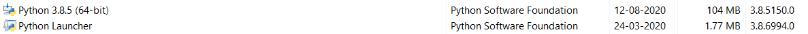
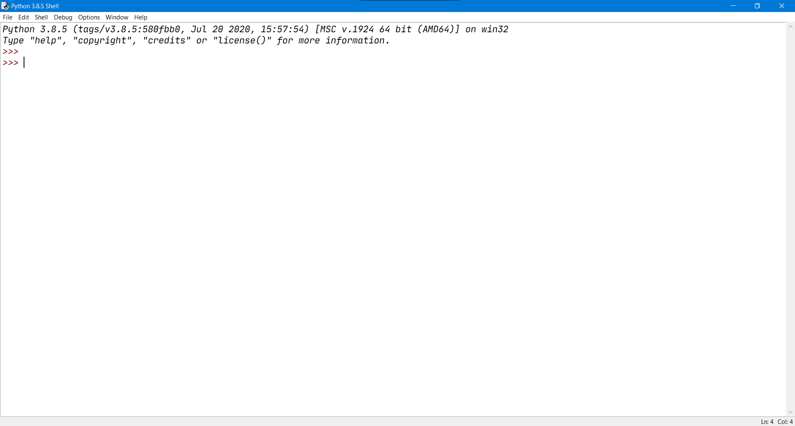
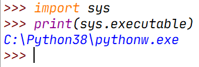
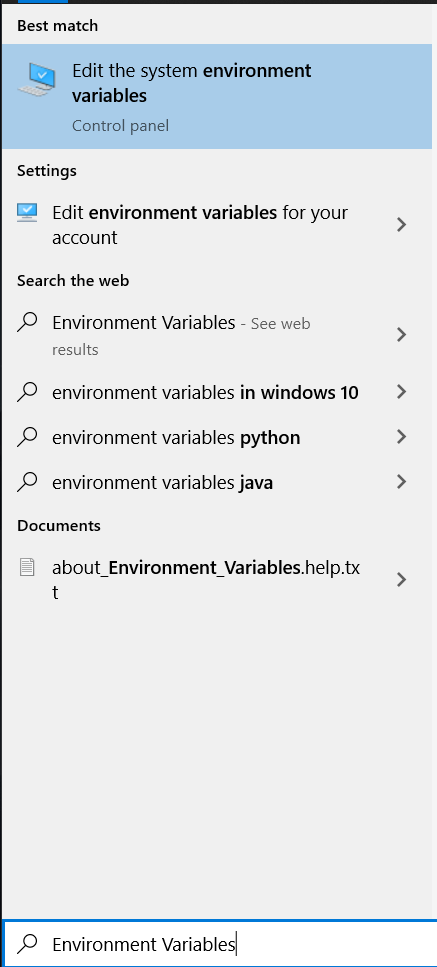
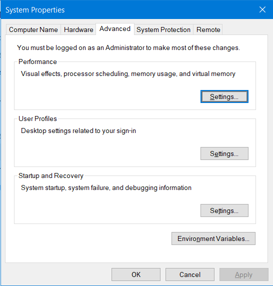
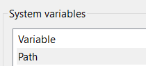
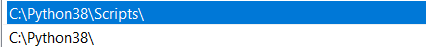

# Adding Python to your PATH

## Windows only

Windows users often face a common error while installing/using Python. 

This error is that python does not get added to Windows' Path which means that we cannot use it anywhere we want on the system.

This is a small guide to help users with this exact problem

## Step 1 - Checking if Python is installed:

To check if Python is installed, we need to see the list of installed Programs. 

To see the list, open **Start** and type "Control Panel" to search for it.

Open Control Panel and look for the option that says Programs and Features. Click on that and you should see a list of programs appear.

Browse through this list and check if Python is there. If it is, you should see it like this:

If it is, move onto Step 2. If you cannot see it, follow this guide:

## Step 2 - Checking the install location of Python

Open the Python IDLE. 

You should see a screen like this:

Now, to get the location of our Python installation, we need to do the following steps:

- `import sys`
- `print(sys.executable)`
- Once you type the above commands into your IDLE, you should get a screen like this:

- Copy the string outputted.

## Step 3 - Adding the string to PATH.

Now that we have the location of our Python Installation, we can add it to the PATH variable in Windows 

To edit the PATH variable, open the Start Menu and Search for **"Environment Variables".** You should see an option like this popup:

---

Click on the option that says "Edit the system environment Variables" and it will open a new window.

---

Click on **Environment Variables**.  Another window will popup. Select **Path within the System Variables and click on Edit**

---

This should open another window where you will get a list of sorts. Now, remember the string that we copied earlier? We have to place that here so that we can use python anywhere.

**NOTE: The string we copied earlier had the full path. We need only the part without the `.exe` part.** 

**So in my case, I only need `C:\Python38\`  instead of `C:\Python38\pythonw.exe` .**

 Now, to add the Python Folder to PATH, click on **NEW**. Now paste the string that we copied.

**Now click on NEW again but this time, add this part to the end of the python Path: `Scripts\`**

Once that is done, it should look like this:

Click on OK on all three windows. 

Now we have successfully added Python to Path!

If you liked this guide, feel free to share it with others as well.